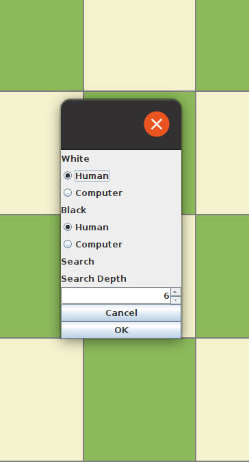
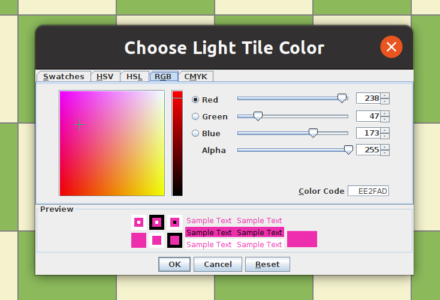

This is an AI-enabled chess engine developed using a depth-limited MiniMax algorithm in the Java programming language. The project took approximately 3 months and I undertook it as I myself am a chess enthusiast, playing almost every day. In the program, the user gets to choose to what depth of moves the computer analyzes the board, and play against the bot for training. I have used this bot for training myself and managed to increase my ELO rating by 20%! The program also enables player vs. player gameplay. The algorithm was able to reach <strong> International Master </strong> status on Chess.com on a depth of 10. The GUI is made using Java Swing and is highly customizable. The algorithm was developed based on the instructions of Software Architecture and Design.

 

  
In order to play a game, simply navigate to "Options" and select "Setup Game" like so:

 

From here, select the setup you prefer and play on!
You can also customize the chess board to your preference from "Preferences":

 

Enjoy :)
