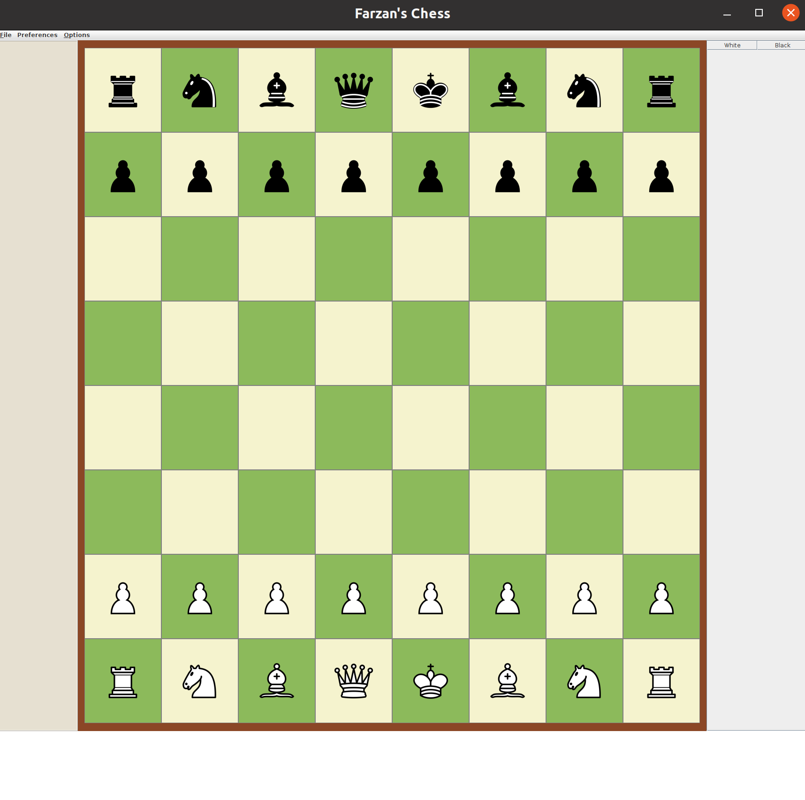

This is an AI-enabled chess engine developed using a depth-limited MiniMax algorithm in the Java programming language. The user gets to choose to what depth of moves the computer analyzes the board, and play against the bot for training. The program also enables player vs. player gameplay. The algorithm was able to reach <strong> International Master </strong> status on Chess.com on a depth of 10. The GUI is made using Java Swing and is highly customizable. The algorithm was developed based on the instructions of Software Architecture and Design.  

